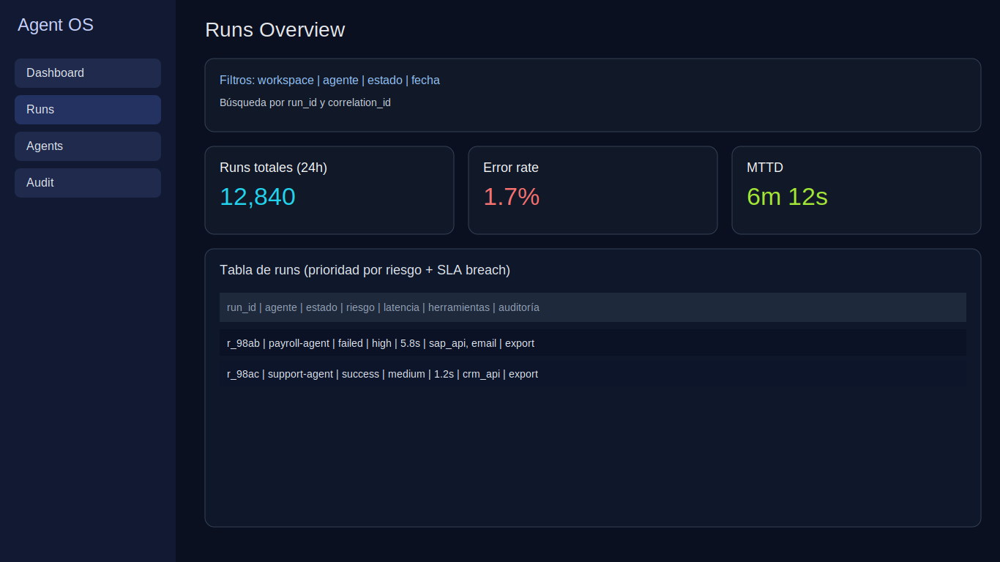
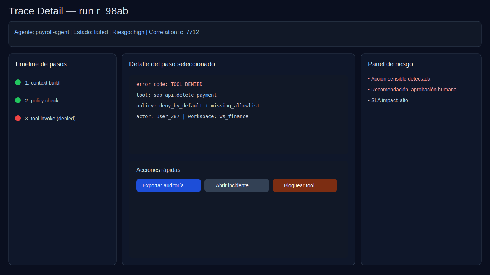
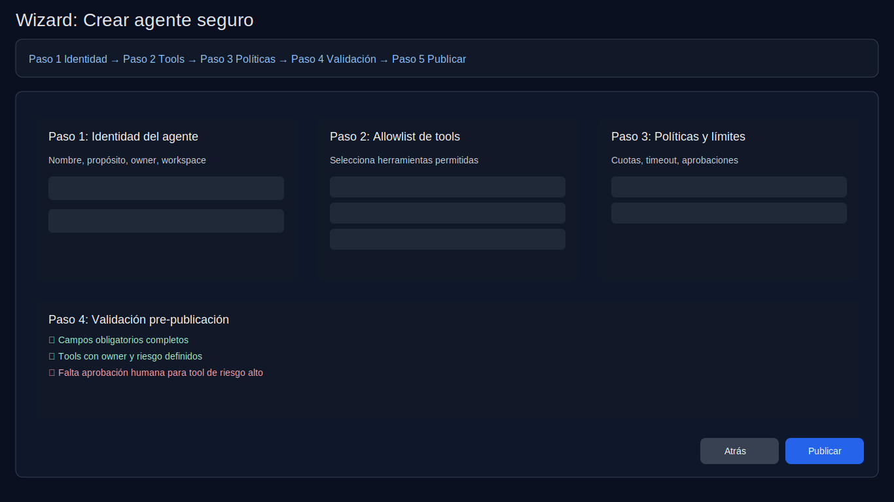

# UX Guidelines v1 — Agent OS

## Principios
1. **Control antes que glamour:** toda pantalla debe facilitar decidir, no decorar.
2. **Explicabilidad por defecto:** cada acción sensible debe mostrar "qué pasó" y "por qué".
3. **Prevención de error:** deny-by-default visible y validaciones previas a publicación.
4. **Diagnóstico rápido:** diseño orientado a reducir MTTD y MTTR.
5. **Consistencia operacional:** mismos patrones para filtros, estados y severidad.

## Roles UX
- **AI Engineer:** configura agentes, tools y revisa trazas.
- **Security Admin:** valida riesgo, políticas y acciones sensibles.
- **Auditor:** exporta evidencia y valida integridad de historial.

## Patrones obligatorios
- Barra de filtros persistente en vistas de Runs.
- Tabla con orden por riesgo/SLA y accesos a drill-down.
- Timeline de traza con foco en paso fallido.
- Panel lateral de riesgo y recomendaciones.
- CTA de exportación de auditoría en contexto.

## Estados de interfaz
- **Loading:** skeletons por bloque (no spinner global prolongado).
- **Empty:** mensaje con siguiente acción concreta.
- **Error recuperable:** acción de retry + enlace a soporte.
- **Error crítico:** freeze de acción sensible + ruta de escalamiento.

## Accesibilidad mínima
- Contraste AA.
- Navegación con teclado en tablas y timeline.
- Etiquetas ARIA para acciones críticas.
- No depender solo de color para severidad.

## Propuestas visuales
### 1) Dashboard de runs

### 2) Detalle de traza

### 3) Wizard de creación de agente

